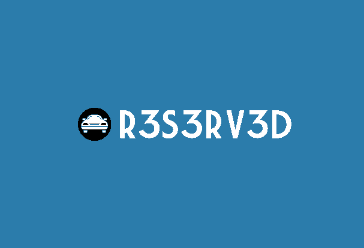

# CMPE443 Car Project
## R3S3RV3D

### Pins
| LPC4088 pin | Connection | Function | Purpose |
|:-----------:|:----------:|:--------:|:-------:|
|P1.24|P5|GPIO|IN2 - Left Motors|
|P1.23|P6|GPIO|IN1 - Left Motors|
|P1.20|P7|PWM1[2]|LED Blinking|
|P0.21|P8|GPIO|FR LED|
|P0.0|P9|UART3 TX|WiFi RX|
|P0.1|P10|UART3 RX|WiFi TX|
|P0.9|P11|T2_MAT_3|Ultrasonic Trigger|
|P0.8|P12|GPIO|WiFi CH_PD|
|P0.7|P13|GPIO|WiFi RST|
|P0.23|P15|ADC0[0]|Trim Pot|
|P0.24|P16|T3_CAP_1|Ultrasonic Echo|
|P0.25|P17|ADC0[2]|LDR Right|
|P0.26|P18|ADC0[3]|LDR Left|
|P1.30|P19|GPIO|BL LED|
|P1.31|P20|GPIO|BR LED|
|P0.29|P23|EINT0|Push Button|
|P1.11|P25|PWM0[6]|ENB - Right Motors|
|P1.7|P26|PWM0[5]|ENA - Left Motors|
|P1.6|P27|GPIO|FL LED|
|P0.5|P33|GPIO|IN3 - Right Motors|
|P0.4|P34|GPIO|IN4 - Right Motors|

